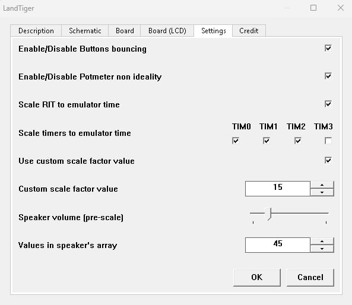
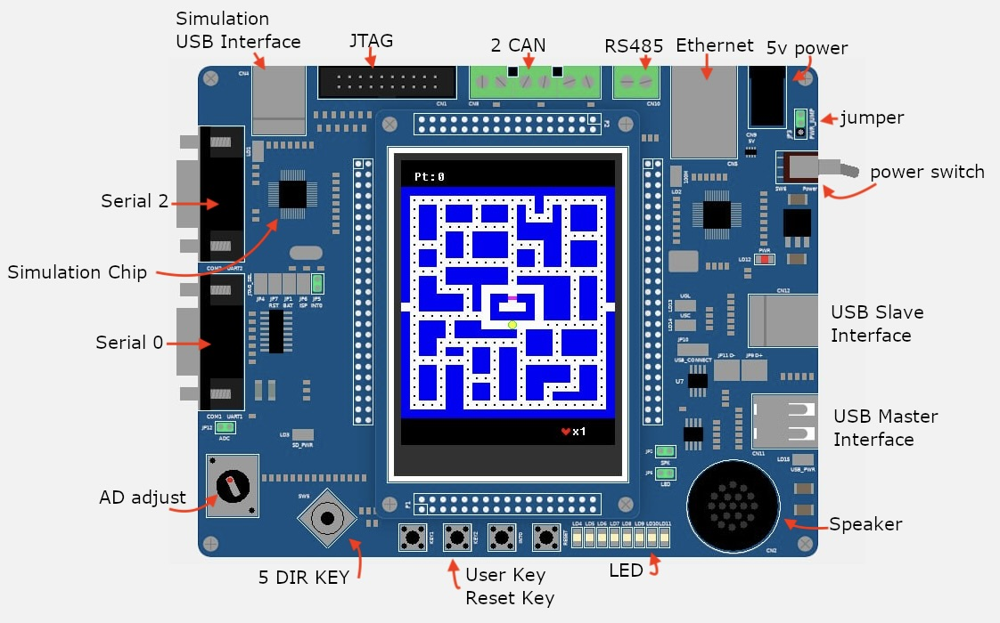
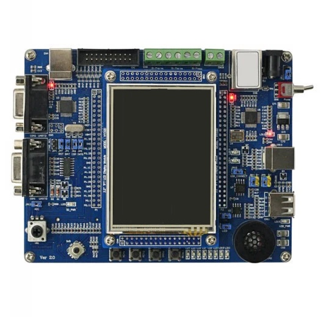
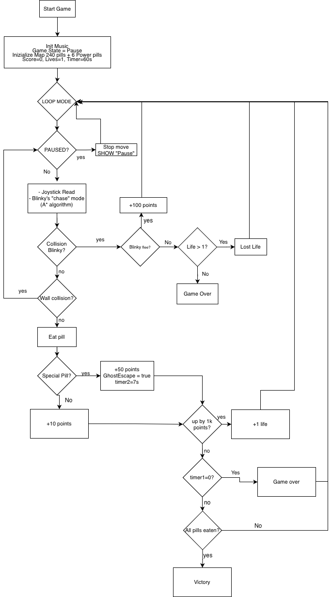

## Pac-Man Emulator - LPC1768 (LandTiger)
Development of the classic Pac-Man game for the LandTiger LCP1768 board, implemented in C and ARM Assembly.

## How to run (Emulator case)
To run this project, you need to have **Keil µVision** installed (only Windows).

- Import the project from this repository
- Select Target: LandTiger_LPC1768 or Emulator (SW_DEGUB)
- Build target files (F7)
- Start Debug Session (Ctrl + F5)
- Peripherals -> LandTiger -> Right-click on the emulator -> Settings -> Use these settings for the best experience

- Run (F5)
- Play using your keyboard arrow keys

## Demos

- Watch the demo (mid-development), sub EN/DE : [https://youtu.be/ADXPWDtmEAg](https://youtu.be/ADXPWDtmEAg)
- Watch the final demo: [Click here](LINK_2)

## Technical Overview

| Component            | Details                                                                      |
|----------------------|------------------------------------------------------------------------------|
| **Board**            | LandTiger LPC1768                                                            |
| **Display**          | 3.2″TFT COLOR LCD                                                            |
| **MCU**              | ARM 32-bit Cortex-M3 microcontroller                                         |
| **Languages**        | C, ARM Assembly                                                              |
| **Environment**      | Keil µVision (bare-metal)                                                    |
| **Peripherals Used** | LCD (graphics rendering), Timers (game timing), Interrupts (event handling), |
|                      | Joystick & Buttons (input), LEDs (feedback), Buzzer (game music).                  |                    

## Key Feature: Blinky Pathfinding (A* Algorithm)

The most interesting function in the project is the AI controlling Blinky’s movement, implemented in `Blinky.c` through an A* pathfinding algorithm.
The algorithm is used to compute the optimal path from Blinky to Pac-Man on the game map.

### Algorithm logic
The A* algorithm is based on the evaluation function:

f(n) = g(n) + h(n)

Where:
- g(n): actual cost from the starting node
- h(n): heuristic estimate of the distance to the goal
- f(n): total estimated cost of the path

### In this project context

- **Start node:** Blinky position  
- **Goal node:** Pac-Man position  
- **Graph representation:** game map (grid matrix)  
- **Nodes:** walkable cells in the matrix  

The algorithm continuously recalculates the optimal path to allow dynamic chasing behaviour during gameplay.

## LandTiger1768 + Emulator

    
    

## Logic of the game

    

## Project Structure

- /Source
    - /adc
    - /button_EXINT
    - /CMSIS_core
    - /GLCD
    - /joystick
    - /led
    - /music
    - /RIT
    - /timer
    - /TouchPanel
    - sample.c
    - startup_LPC17xx.s
    - system_LPC17xx.c
- Blinky.c
- Blinky.h
- /DebugConfig
- /Listings
- /Objects
- /RTE